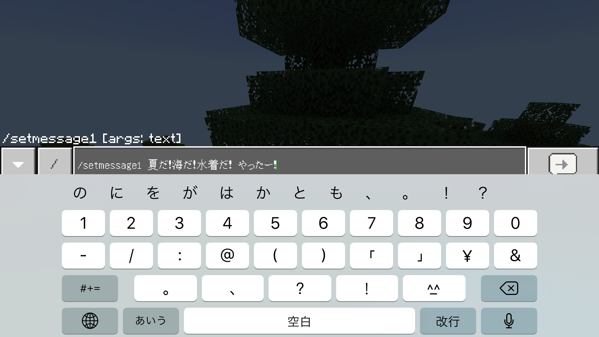
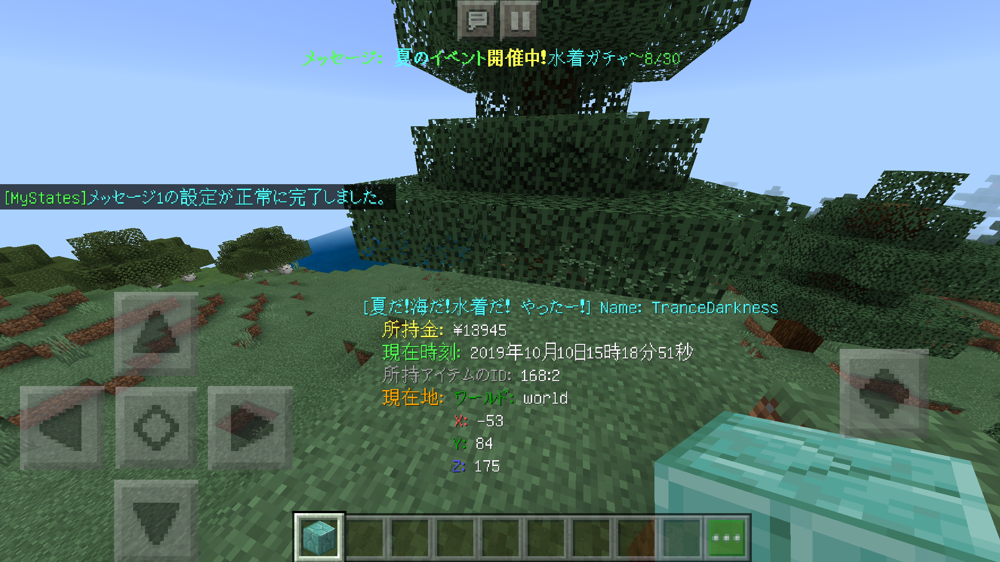

# MyStatus-for-Nukkit
自分のステータスを画面下部に表示します。  
[Download](https://github.com/gamesukimanIRS/MyStatus-for-Nukkit/releases/tag/v1.0.0)  


### 概要
自分の名前、自分の所持金、現在時刻、自分の現在地を画面下部に表示します。  
また、画面上部にお知らせを掲示したり、ステータスの上部にメッセージを付け加えたりできます。  
これらのメッセージ・お知らせは、Config又はコマンドで変更できます。  

所持金はEonomySystemの所持金で、前提プラグインとしてEconomySystemAPIが必要になります。  
EconomySystemAPIは、[こちら](https://github.com/tedo0627/Horizon-2nd)の[ここ](https://github.com/tedo0627/Horizon-2nd/blob/master/Plugins/EconomySystemAPI.jar)からダウンロードできます。  
  
各部の説明  


##### コマンド
|コマンド|説明|初期値|権限|
|:-:|:--|:--|:-:|
|`/setmessage1`|ステータス上部の文字列を変更します。|MyStatus|OP|
|`/setmessage2`|画面上部の文字列を変更します。|このメッセージ・ステータスはMyStatus for Nukkitが表示しています。|OP|

全てのコマンドについては、ダブルクォーテーションを付けずスペースを使用することが可能です。  



##### Config
メッセージ設定ファイルとして、`message.yml`が生成されます。  
```yaml
Message1: MyStatus
Message2: このメッセージ・ステータスはMyStatus for Nukkitが表示しています。
```
値を変えると、メッセージを変更することができます。  
Messageの1、2については各部の説明を参考にしてください。

##### 使用している機能
このプラグインは20tickのリピートタスク（スケジューラー）を利用しています。  
ステータスにTip、メッセージにActionBarを利用しています。  
そのため、Tip・ActionBarに常に何かを表示させるプラグインとは競合します。  
また、Popupに常に何かを表示させるプラグインとは表示が重なる場合があります。  

### ライセンス
二次配布、改造配布、プラグインの横流し、悪用を禁止します。  
自分用、又は友人用の改造は許可します。  
このプラグインで発生したすべての問題に対して製作者は責任は負いません。  
都合により、プラグインの破棄を要請する場合があります。その際は、要請に従いプラグインを破棄してください。
EconomySystemAPIについては、EconomySystemAPIのライセンスに則ってご使用ください。  
