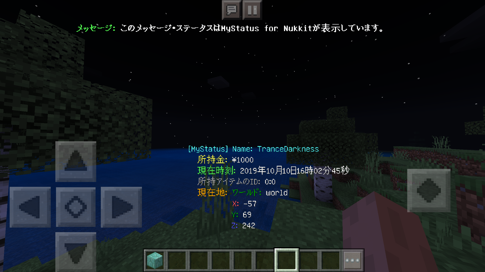
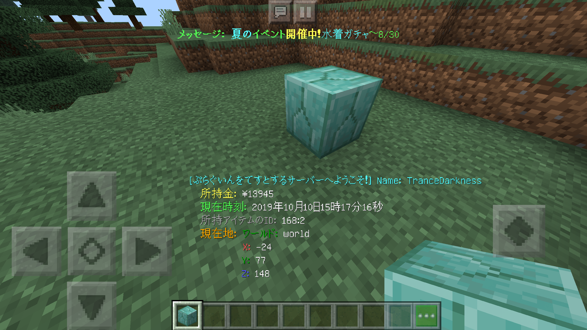
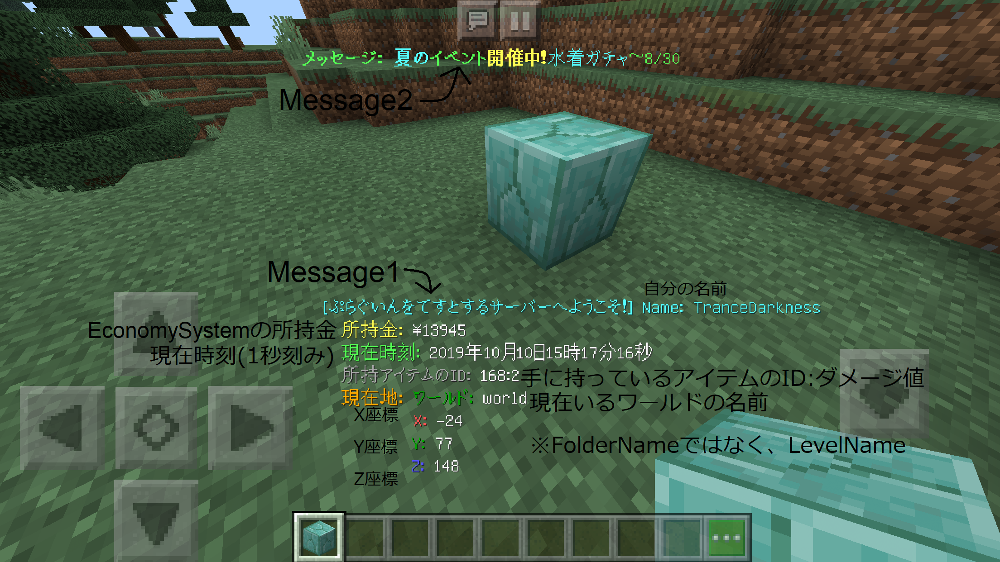

# MyStatus-for-Nukkit
自分のステータスを画面下部に表示します。  
[Download](https://github.com/gamesukimanIRS/MyStatus-for-Nukkit/releases/tag/v1.0.0)  

### 概要
自分の名前、自分の所持金、現在時刻、自分の現在地を画面下部に表示します。  
また、画面上部にお知らせを掲示したり、ステータスの上部にメッセージを付け加えたりできます。  

所持金はEonomySystemの所持金で、前提プラグインとしてEconomySystemAPIが必要になります。  
EconomySystemAPIは、[こちら](https://github.com/tedo0627/Horizon-2nd)の[ここ](https://github.com/tedo0627/Horizon-2nd/blob/master/Plugins/EconomySystemAPI.jar)からダウンロードできます。  
  
各部の説明  

##### コマンド
|コマンド|説明|初期値|権限|
|:-:|:--|:--|:-:|
|`/setmessage1`|ステータス上部の文字列を変更します。|MyStatus|OP|
|`/setmessage1`|画面上部の文字列を変更します。|このメッセージ・ステータスはMyStatus for Nukkitが表示しています。|OP|

##### 使用している機能
このプラグインは20tickのリピートタスク（スケジューラー）を利用しています。  

